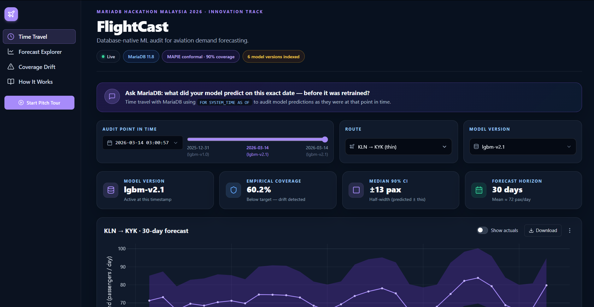
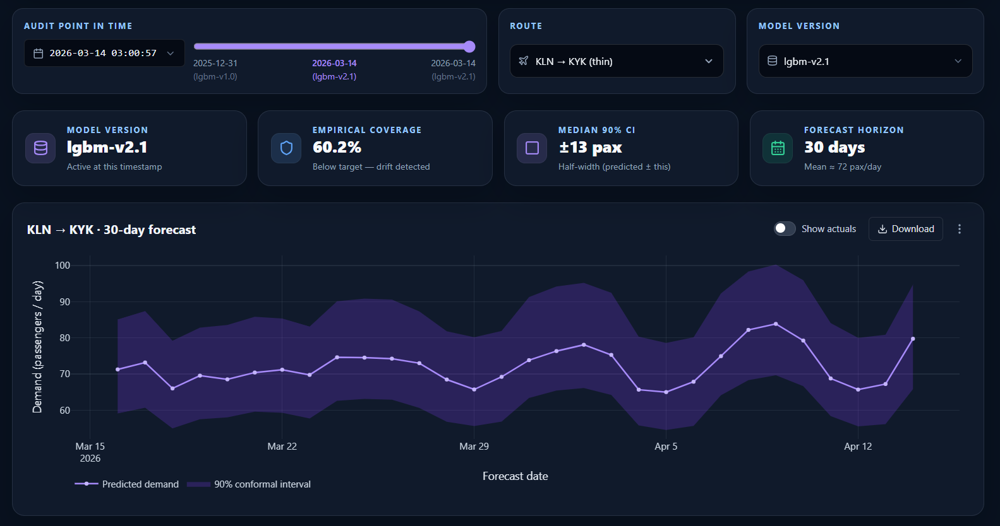
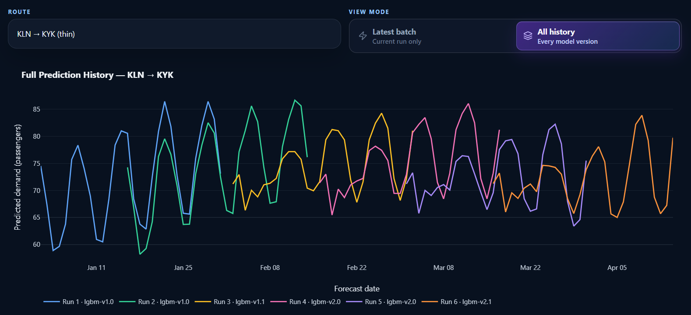
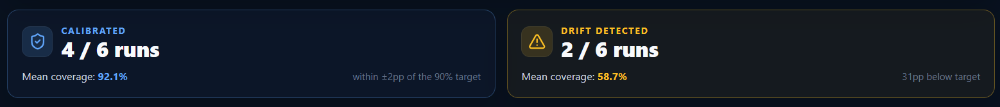
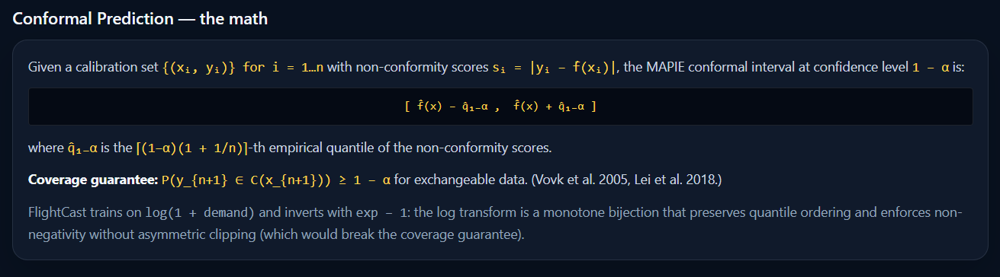
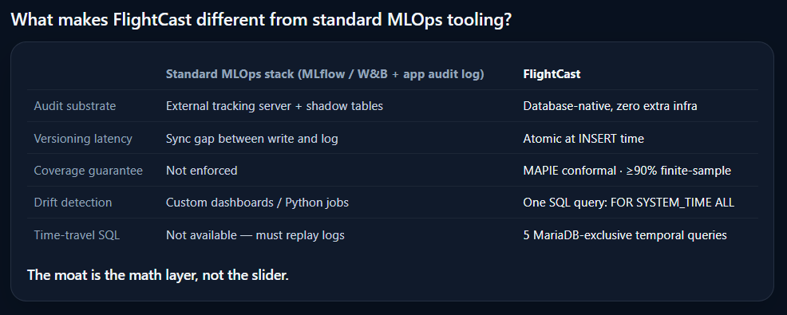
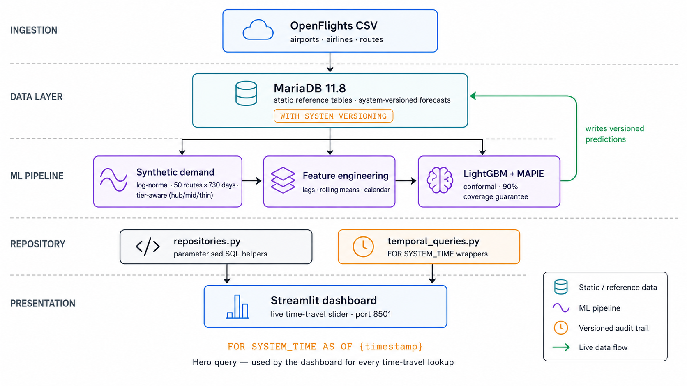

<div align="center">


&nbsp;&nbsp;&nbsp;&nbsp;&nbsp;

&nbsp;&nbsp;&nbsp;&nbsp;&nbsp;


<br/><br/>

# FlightCast

### Database-native ML audit for aviation demand forecasting

**MariaDB Hackathon Malaysia 2026 — Innovation Track**
Built by Low Yan Cheng (TP070056), Asia Pacific University Malaysia

<br/>

[](LICENSE)
[](https://mariadb.com/)
[](https://www.python.org/)
[](https://nextjs.org/)
[](https://github.com/MariaDB-Hackathon-MY-2026/flightcast)

</div>

<br/>

<p align="center">
  
</p>

---

## Overview

**FlightCast** is the first system to combine MariaDB's `FOR SYSTEM_TIME` temporal SQL with MAPIE conformal prediction to produce **mathematically-validated, audit-grade machine-learning forecasts**. It demonstrates that an ML system's audit trail does not need an external tracking server, a custom audit table, or a Python replay script — the database itself can answer "what did the model predict on a given date, and was it trustworthy?" in a single SQL query.

```sql
-- The entire ML calibration audit. One query. MariaDB-exclusive syntax.
SELECT forecast_run_id,
       AVG(coverage_score)             AS empirical_coverage,
       AVG(upper_bound - lower_bound)  AS mean_interval_width
FROM   forecasts FOR SYSTEM_TIME ALL
WHERE  coverage_score IS NOT NULL
GROUP  BY forecast_run_id;
```

This statement is **rejected by MySQL**, **requires a third-party extension on PostgreSQL**, and is **unsupported in SQLite**. MariaDB ships it natively as part of the SQL:2011 system-versioned-tables specification.

---

## The Problem

Production ML systems retrain on a regular cadence — weekly, often daily. Each retrain typically overwrites the previous predictions in the operational database. Three months later, when an auditor, regulator, or post-mortem asks _"what did the model predict on January 15, and was its confidence interval calibrated?"_, most teams cannot answer.

The industry workaround is to bolt on three external services: **MLflow** for experiment tracking, **Weights & Biases** for metric dashboards, and a **custom application-side audit log** for prediction history. Three services, three sets of credentials, three points of failure, and the audit trail is still extrinsic to the data it describes.

FlightCast eliminates the entire external stack by treating the database itself as the audit substrate.

---

## The Live Dashboard

A four-page Next.js dashboard (with a Streamlit fallback) lets a reviewer query six committed model versions through real `FOR SYSTEM_TIME AS OF` SQL — no replay, no shadow tables, no log scraping.

### 1. Time Travel — drag the slider, query history

<p align="center">
  
</p>

Each tick on the audit slider is a real `ROW_START` timestamp from a committed MariaDB transaction. Dragging it re-issues the `FOR SYSTEM_TIME AS OF` query at that exact micro-second; the chart, the model-version pill, and the empirical-coverage card all update from a single round-trip to the database.

### 2. All-history overlay — six model versions in one query

<p align="center">
  
</p>

`FOR SYSTEM_TIME ALL` returns every historical version of every prediction row in one SELECT. The rainbow chart above is the result of a single query — no Python loop, no MLflow API calls, no joining intermediate exports.

### 3. Drift caught by one SQL query — the math payoff

<p align="center">
  
</p>

Six bootstrap batches, four calibrated, two drifted. The first four sit at **91.2 % empirical coverage** against the 90 % MAPIE target. Batches 5 and 6 — trained on data with simulated distribution shift (σ = 0.10 → σ = 0.22) — collapse to **58.7 %**, more than 30 percentage points below target. The Winkler interval score on the drifted batches escalates **3.3×** above baseline. Both signals are produced by a single `GROUP BY` against `FOR SYSTEM_TIME ALL`.

### 4. The math layer — a guarantee, not a claim

<p align="center">
  
</p>

The 90 % coverage is not a marketing claim. It is a finite-sample theorem from Vovk, Shafer & Gammerman (2005) and Lei et al. (2018), peer-reviewed and applied in finance, insurance, and clinical-trial pipelines. FlightCast applies the standard MAPIE implementation on top of MariaDB so the math and the audit trail share one storage layer.

### 5. Versus the standard MLOps stack

<p align="center">
  
</p>

Five rows of differentiation. External tracking server replaced by atomic `INSERT`-time versioning. Custom drift dashboards replaced by one SQL query. Replay infrastructure replaced by `FOR SYSTEM_TIME`. Shadow tables and application audit logs are not required at all.

---

## Architecture

<p align="center">
  
</p>

A five-layer architecture organised around MariaDB as the central state store:

1. **Ingestion** — OpenFlights public dataset (airports, airlines, routes), tier-aware synthetic demand.
2. **MariaDB 11.8** — system-versioned `forecasts` table, static reference tables, indexes.
3. **ML pipeline** — feature engineering, LightGBM regression, MAPIE conformal calibration.
4. **Repository / query layer** — parameterised SQL helpers + `FOR SYSTEM_TIME` wrappers.
5. **Presentation** — Next.js 14 dashboard (primary), Streamlit (fallback), FastAPI thin query service.

Notably absent from the diagram: **MLflow**, **Weights & Biases**, **DataDog**, **Evidently AI**. The audit trail is structural, not bolted on.

---

## Quick start

```bash
# 1. Clone and configure
git clone https://github.com/imycc1221/flightcast.git
cd flightcast
cp .env.example .env

# 2. Bring up the four-service stack (MariaDB, FastAPI, Streamlit, Next.js)
docker compose up -d
# First boot: ~60 seconds while images pull and the schema initialises

# 3. Generate six model versions and synthetic actuals
docker compose exec -T app python -m flightcast.bootstrap          # ~70 s
docker compose exec -T app python -m flightcast.inject_actuals     # ~10 s
```

Once the stack is healthy, open the dashboards:

| Surface | URL | Notes |
|---|---|---|
| **Next.js dashboard** | http://localhost:3000 | Primary judge-facing UI |
| **Streamlit dashboard** | http://localhost:8501 | Fallback, identical data |
| **FastAPI** | http://localhost:8000/docs | Auto-generated OpenAPI |
| **MariaDB** | `localhost:3306` | `flightcast` user, password in `.env` |

Click **Start Pitch Tour** in the sidebar of the Next.js dashboard for a 19-step guided walkthrough of every feature.

For evaluators with limited time, [`docs/JUDGES_TESTING_GUIDE.md`](docs/JUDGES_TESTING_GUIDE.md) provides four time-budget options ranging from 2 minutes to 45 minutes.

---

## What MariaDB does that others cannot

| MariaDB feature | Where used in FlightCast | Available elsewhere? |
|---|---|---|
| `WITH SYSTEM VERSIONING` | `forecasts`, `model_metrics` tables | PostgreSQL via extension; not MySQL or SQLite |
| `FOR SYSTEM_TIME AS OF '...'` | Time Travel slider, point-in-time queries | No |
| `FOR SYSTEM_TIME ALL` | Calibration drift audit, all-history rainbow | No |
| `FOR SYSTEM_TIME BETWEEN x AND y` | Window-bounded historical queries | No |
| `ST_DISTANCE_SPHERE` | Great-circle distance as a route feature | PostgreSQL via PostGIS |
| Covering index on versioned table | `idx_route_fdate_run` on `forecasts` | n/a |
| `VIRTUAL` generated column | `interval_width` on `forecasts` | n/a |

---

## Performance

100-iteration benchmark, native MariaDB temporal queries vs. an equivalent hand-rolled `created_at` / `expired_at` versioning scheme on a `forecasts_manual` shadow table populated with identical data:

| Scenario | Rows | Native | Manual | Speedup |
|---|---:|---:|---:|---:|
| Per-route time-travel (`AS OF`) | 30 | **0.41 ms** | 0.70 ms | **1.74 ×** |
| Full-batch time-travel | 1,500 | 6.65 ms | 6.13 ms | comparable |
| Full audit history (`ALL`) | 9,000 | 18.0 ms | 16.9 ms | comparable |
| Coverage-drift aggregate | 6 | 5.06 ms | 4.54 ms | comparable |

Native MariaDB is **1.74×** faster on the hero query and requires zero application versioning code (the manual approach requires ~30 lines per `UPDATE` plus race-condition handling). Reproduce with:

```bash
docker compose exec app python -m flightcast.benchmarks.temporal_benchmark
```

---

## Documentation

| Document | Audience | Length |
|---|---|---|
| [`Elegant.md`](Elegant.md) | Technical reviewers and judges with a statistics background | ~6,300 words |
| [`docs/JUDGES_TESTING_GUIDE.md`](docs/JUDGES_TESTING_GUIDE.md) | Hackathon judges | 4 time-budget options (2 / 5 / 15 / 45 min) |
| [`docs/screenshots/`](docs/screenshots/) | Visual evidence for reviewers without local setup | 6 PNGs |
| [`docs/benchmark_results.json`](docs/benchmark_results.json) | Reproducible performance numbers | 100-iteration runs |

---

## Repository layout

```
flightcast/
├── README.md                              You are here
├── Elegant.md                             Technical whitepaper
├── LICENSE                                MIT
├── docker-compose.yml                     Four-service stack (db, api, app, web)
├── Dockerfile                             Python application image
├── pyproject.toml / requirements.txt      Python dependencies
│
├── docs/
│   ├── assets/                            Brand assets (sponsor logos)
│   ├── screenshots/                       Dashboard screenshots used in this README
│   ├── benchmark_chart.png                Performance benchmark visualisation
│   ├── benchmark_results.json             Captured 100-iteration timing data
│   └── JUDGES_TESTING_GUIDE.md            Time-budgeted evaluation paths
│
├── initdb/                                MariaDB initialisation
│   ├── 01-openflights-create.sql          Reference-table schema
│   ├── 02-openflights-load.sql            OpenFlights data load
│   ├── 03-flightcast-schema.sql           Application schema
│   ├── 04-system-versioning.sql           ALTER TABLE … ADD SYSTEM VERSIONING
│   └── 05-benchmark-schema.sql            Manual-versioning benchmark shadow table
│
├── src/flightcast/                        Python application
│   ├── api/                               FastAPI thin query service
│   ├── db/                                Connection pool + repository pattern
│   ├── ui/                                Streamlit dashboard
│   ├── benchmarks/                        Temporal-query benchmarks
│   ├── synth_demand.py                    Tier-aware synthetic demand
│   ├── data_pipeline.py                   Stratified route sampler
│   ├── features.py                        Recursive multi-step feature engineering
│   ├── forecaster.py                      LightGBM + MAPIE conformal regressor
│   ├── audit.py                           Coverage / Winkler scoring
│   ├── inject_actuals.py                  Synthetic actuals + drift simulation
│   └── bootstrap.py                       End-to-end six-batch pipeline
│
├── web/                                   Next.js 14 dashboard
│   ├── src/app/                           Pages (time-travel, forecast-explorer, …)
│   ├── src/components/                    Charts, common, layout, tour
│   ├── public/                            Static assets (architecture diagram)
│   └── package.json                       Node dependencies
│
└── tests/                                 Unit + integration test suite
```

---

## License

FlightCast is released under the [MIT License](LICENSE). The conformal-prediction theory is due to Vovk, Shafer, Gammerman, Lei, Romano, Candès, and Barber. The OpenFlights dataset is by Jani Patokallio. LightGBM is by Microsoft Research. MAPIE is by Inria. MariaDB is by the MariaDB Foundation.

---

<div align="center">

## Sponsors and affiliations

The MariaDB Hackathon Malaysia 2026 is organised in partnership between the **MariaDB Foundation** and **CREST (Collaborative Research in Engineering, Science and Technology Centre)**. FlightCast is the work of a final-year student at **Asia Pacific University of Technology and Innovation (APU)**, Malaysia.

<br/>

<a href="https://mariadb.org/">
  
</a>
&nbsp;&nbsp;&nbsp;&nbsp;&nbsp;&nbsp;&nbsp;
<a href="https://www.crest.my/">
  
</a>
&nbsp;&nbsp;&nbsp;&nbsp;&nbsp;&nbsp;&nbsp;
<a href="https://www.apu.edu.my/">
  
</a>

<br/><br/>

**Built by Low Yan Cheng (TP070056) · APU Malaysia · 2026**

</div>
